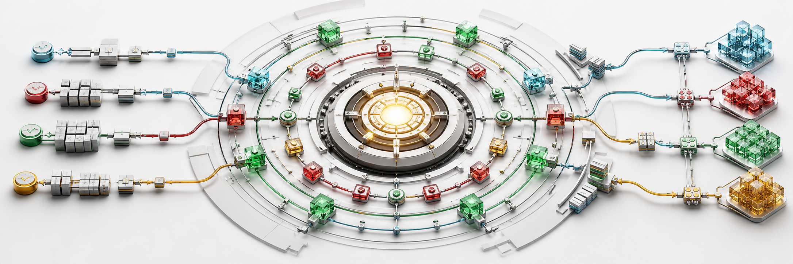
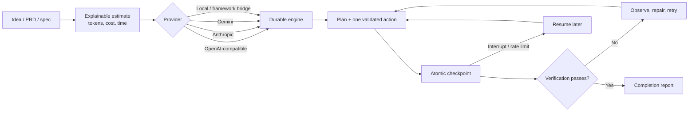
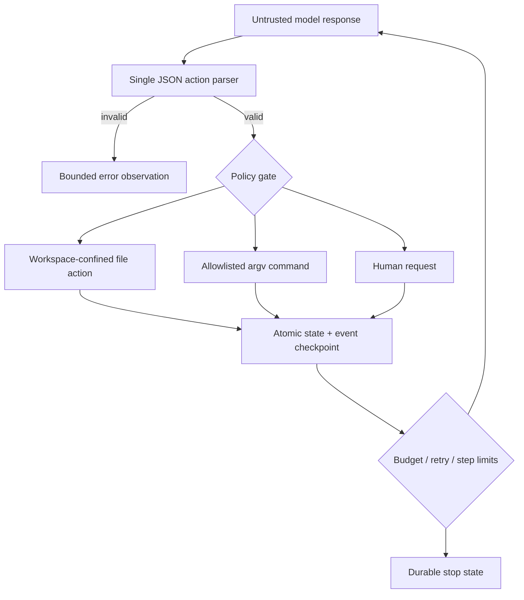
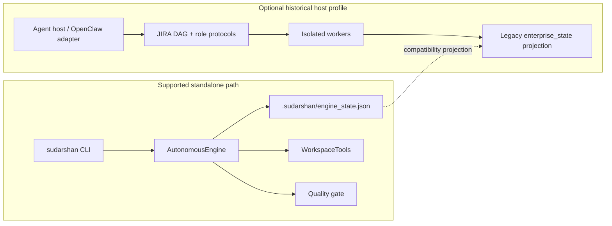

<p align="center">
  
</p>

<h1 align="center">Sudarshan</h1>

<p align="center"><strong>Bring a brief. Bring a model. Keep the state.</strong></p>

<p align="center">
  A provider-neutral, resumable software-build harness that puts deterministic state,
  tools, budgets, retries, and verification around probabilistic LLMs.
</p>

<p align="center">
  
  <a href="https://github.com/Suraj1235/sudarshan-superharness/actions/workflows/ci.yml"></a>
  
  
  
</p>

Sudarshan accepts an **idea, PRD, or technical specification**, produces an explainable
token/cost/time estimate, then drives an LLM through a durable JSON action loop until
the project passes real verification or reaches an explicit stop condition.

It runs directly against OpenAI-compatible APIs, Anthropic, Gemini, local models, or
any agent framework exposed through a small command bridge. **OpenClaw is optional.**

> [!IMPORTANT]
> Sudarshan is alpha software. It makes orchestration more deterministic; it does not
> make model reasoning mathematically perfect or guarantee production-quality output.
> Generated software still needs human review, threat modeling, and deployment judgment.

## Why This Exists

Suraj Kuncham began Sudarshan months ago, when coding models were markedly less capable
and agent harnesses were still nascent. The original research asked a useful question:

> What if the conversation were disposable, but the plan, evidence, budget, failures,
> and verification state were not?

Modern models make that thesis more practical, not automatically proven. With a capable
model and a very large user-authorized token/runtime budget, Sudarshan can sustain long
checkpointed builds and periodic retries. `--retry-forever` supports effectively
unbounded retry duration until the operator interrupts it; no process has literal
infinite runtime, and no token budget can make flawed requirements or verification safe.

## The Working Journey



The model proposes actions. Sudarshan owns whether those actions are valid, where they
may write, which commands may execute, what counts as completion, and what survives a
restart.

## Quickstart

### 1. Install

```bash
git clone https://github.com/Suraj1235/sudarshan-superharness.git
cd sudarshan-superharness
python -m venv .venv
```

Activate the environment, then install:

```bash
# macOS / Linux
source .venv/bin/activate

# Windows PowerShell
# .venv\Scripts\Activate.ps1

python -m pip install -e .
sudarshan doctor
```

The standalone runtime needs Python 3.9+. Node, Docker, SearXNG, Git, and OpenClaw are
optional capabilities, not installation prerequisites.

### 2. Estimate Before Spending

```bash
sudarshan estimate \
  --prd ./PRD.md \
  --model YOUR_MODEL_ID \
  --input-price 1.00 \
  --output-price 4.00 \
  --json
```

The estimator emits low/likely/high ranges and every coefficient used. It is an
explainable heuristic, not a calibrated promise; repository size, model behavior,
provider latency, retries, and verification depth can dominate actual usage.

### 3. Build

```bash
export SUDARSHAN_API_KEY="your-key"

sudarshan build \
  --prd ./PRD.md \
  --workspace ./builds/my-product \
  --provider openai-compatible \
  --model YOUR_MODEL_ID \
  --base-url https://YOUR_PROVIDER/v1 \
  --input-price 1.00 \
  --output-price 4.00 \
  --max-cost 100 \
  --allow-host-commands
```

The repository includes `examples/demo_command_bridge.py`, a deterministic transport
demo that builds and verifies a tiny calculator without an API key. It proves the
bridge and completion path; it is not presented as an LLM benchmark.

`--allow-host-commands` is deliberate. Model-requested commands run with your user
privileges; path confinement is **not** an OS sandbox. Use a disposable VM, container,
or low-privilege account for untrusted builds.

### 4. Inspect And Resume

```bash
sudarshan status --workspace ./builds/my-product
sudarshan resume --workspace ./builds/my-product
```

Provider and runtime settings are restored from `.sudarshan/run_config.json`. API keys
are read from their environment variable again and are never stored in run state.

If the engine requests a real-world decision:

```bash
sudarshan input \
  --workspace ./builds/my-product \
  --value "Use the EU region and PostgreSQL"

sudarshan resume --workspace ./builds/my-product
```

## Provider Routes

| Route | CLI value | Default key variable | Typical use |
|---|---|---|---|
| OpenAI-compatible | `openai-compatible` | `SUDARSHAN_API_KEY` | OpenAI, OpenRouter, Groq, Together, DeepSeek, vLLM, LM Studio, Ollama, compatible gateways |
| Anthropic Messages API | `anthropic` | `ANTHROPIC_API_KEY` | Native Claude API |
| Gemini generateContent | `gemini` | `GEMINI_API_KEY` | Native Google Gemini API |
| Command bridge | `command` | Bridge-defined | Any local CLI, agent framework, SDK wrapper, or custom inference stack |

### Anthropic

```bash
export ANTHROPIC_API_KEY="your-key"
sudarshan build --spec ./SPEC.md --workspace ./builds/app \
  --provider anthropic --model YOUR_CLAUDE_MODEL --allow-host-commands
```

### Gemini

```bash
export GEMINI_API_KEY="your-key"
sudarshan build --idea "Build a tested inventory API" --workspace ./builds/api \
  --provider gemini --model YOUR_GEMINI_MODEL --allow-host-commands
```

### Free Or Local Models

Point the OpenAI-compatible route at a loopback endpoint. Local HTTP is accepted only
for `localhost`, `127.0.0.1`, or `::1`; remote endpoints must use HTTPS.

```bash
sudarshan build --spec ./SPEC.md --workspace ./builds/local-app \
  --provider openai-compatible \
  --base-url http://127.0.0.1:YOUR_PORT/v1 \
  --model YOUR_LOCAL_MODEL \
  --retry-forever \
  --allow-host-commands
```

No key is required for a loopback endpoint. Results still depend heavily on the local
model's instruction following, context length, and coding ability.

### Any Agent Framework

The command provider sends one JSON request on stdin:

```json
{
  "schema_version": 1,
  "model": "framework-model",
  "messages": [{"role": "system", "content": "..."}],
  "temperature": 0.1,
  "max_output_tokens": 8192
}
```

The bridge returns one JSON object on stdout:

```json
{
  "text": "{\"action\":\"list_files\",\"path\":\".\"}",
  "input_tokens": 1200,
  "output_tokens": 80
}
```

Launch it with an argument array, never a shell string:

```bash
sudarshan build --prd ./PRD.md --workspace ./builds/framework-app \
  --provider command \
  --provider-command-json '["python","my_framework_bridge.py"]' \
  --model framework-model \
  --allow-host-commands
```

## What The Engine Enforces



- Exactly one schema-validated action per model turn
- Immutable plan tasks and dependency ordering once committed
- Workspace path confinement, symlink escape checks, and atomic writes
- Exact-match edits that reject ambiguous replacements
- Command argument arrays with `shell=False`, allowlisting, timeouts, and output caps
- Sensitive environment variables removed from model-requested subprocesses
- Destructive Git recovery commands blocked
- Single-process workspace execution lease with expiry and refresh
- Atomic engine state plus append-only event history after every action
- Preflight input, output, and configured-cost authorization limits, plus step and retry limits
- HTTP `Retry-After` plus periodic exponential backoff persisted across restarts
- Human pause/input/resume without reconstructing a chat transcript
- Operator verification commands that the model cannot remove
- Automatic stack-aware compile, test, lint, and build command detection

## Completion Is A Gate

The model cannot finish merely by saying it is done. All committed plan items must be
complete and every selected verification command must pass.

Sudarshan combines:

1. **Operator commands** supplied with repeatable `--verify-command-json` flags.
2. **Automatic commands** inferred from Python, npm, Cargo, Go, Maven, or Gradle files.
3. **Model commands** proposed during the build, which can add checks but cannot remove
   either of the first two groups.

Example immutable acceptance check:

```bash
sudarshan build --prd ./PRD.md --workspace ./builds/app \
  --model YOUR_MODEL_ID \
  --verify-command-json '["python","-m","pytest","-q"]' \
  --allow-host-commands
```

On success, the workspace receives `COMPLETION_REPORT.md` with the model, steps, token
usage, cost, and exact passing commands.

## Retry And Budget Controls

| Control | Default | Effect |
|---|---:|---|
| `--max-steps` | `200` | Maximum model actions |
| `--retry-initial` | `5s` | First transient backoff |
| `--retry-max` | `300s` | Cap for local exponential backoff |
| `--max-retries` | unlimited | Optional attempt ceiling |
| `--retry-window-seconds` | `21600` | Six-hour transient retry window |
| `--retry-forever` | off | Removes the elapsed retry window |
| `--max-cost` | unset | Reserves the next prompt and caps output using configured prices |
| `--max-input-tokens` | unset | Refuses a call when its conservative prompt bound exceeds remaining usage |
| `--max-output-tokens` | unset | Passes the remaining cumulative allowance to every provider call |
| `--max-output-per-call` | `8192` | Bounds each request before cumulative and cost limits are applied |

Explicit provider `Retry-After` values are honored even when they exceed the local
backoff cap. Authentication, malformed responses, and policy failures fail fast.

Budgets are engine-level call authorization controls. Before each call, Sudarshan uses
the serialized prompt byte count as a conservative provider-neutral input-token bound,
then passes the tightest remaining output allowance through `max_output_tokens`. Cost
reservations depend on the prices you configure, while actual totals use provider-reported
usage. Native adapters enforce the output request cap; custom command bridges must honor
the same contract. Provider-side billing, failed requests that report no usage, and an
untrusted bridge remain outside the engine's control, so use account-level provider limits
as the final financial guardrail.

## Two Architectures, Clearly Separated



The standalone engine is the canonical execution path. `protocol_runtime.py` projects
its real state into the older `enterprise_state` artifacts for compatibility. The
multi-agent roles, Observer, relay baton, and OpenClaw hooks remain an experimental,
host-dependent reference profile rather than a prerequisite or production guarantee.

## Evidence And Limits

| Capability | Current evidence | Status |
|---|---|---|
| Idea/PRD/spec intake and estimate | Deterministic unit and CLI tests | Working; estimate is heuristic |
| Durable standalone build loop | Multi-step local HTTP end-to-end build | Working |
| 429 recovery and resume | Forced rate limit, checkpoint, new-process resume | Working |
| Verification cannot be weakened | Adversarial automatic/operator gate tests | Working |
| Concurrent state ownership | Contention tests plus repeated Windows stress run | Working |
| OpenAI-compatible, Anthropic, Gemini | Wire-contract tests against local HTTP servers | Implemented; live accounts not exercised in CI |
| Command/framework provider | Real subprocess stdin/stdout integration test | Working |
| OpenClaw install adapter | Fresh-agent fixture certification | Compatibility path |
| Autonomous multi-agent swarm | Protocols, adapters, DAG utilities | Experimental / host-dependent |
| Production-scale autonomous delivery | No representative benchmark corpus yet | Not proven |
| OS sandboxing | Explicitly outside current process boundary | Not provided |

Run the same release checks locally:

```bash
python -m pytest tests -q
python verify_installation.py --workspace .
python -m pip wheel . --no-deps
```

## Repository Map

```text
autonomous_engine.py        durable action loop, plans, budgets, retries, completion
sudarshan_cli.py            doctor, estimate, build, status, input, resume
providers.py                OpenAI-compatible, Anthropic, Gemini, command bridge
engine_tools.py             confined file tools and controlled subprocess execution
process_runner.py           bounded cross-platform subprocess capture and termination
quality_gate.py             model-independent verification discovery
estimator.py                explainable token, cost, and elapsed-time ranges
protocol_runtime.py         canonical-state projection into legacy protocol artifacts
safe_edit.py                ownership-token locks for compatibility multi-agent writes
taskmanager.py              legacy gates, strike ledger, and host-profile utilities
templates/                  clean canonical protocol state seeds
skills/                     historical role playbooks
openclaw_*                  optional compatibility adapter and installer helpers
infrastructure/searxng/     optional loopback-only research stack
examples/demo_command_bridge.py runnable command-provider transport demo
tests/                      unit, concurrency, packaging, adapter, and E2E coverage
```

## Optional SearXNG Research Stack

The standalone engine does not need SearXNG. The historical research profile can use
the bundled local-only stack. It is pinned, loopback-bound, limiter-backed, and refuses
to start without an operator-provided secret.

```bash
cd infrastructure/searxng
export SEARXNG_SECRET="$(python -c 'import secrets; print(secrets.token_hex(32))')"
docker compose up -d
```

Do not expose it publicly without following SearXNG's deployment guidance and adding a
proper reverse proxy, authentication policy, monitoring, and update process.

## Contributing

Read [CONTRIBUTING.md](CONTRIBUTING.md) before opening a change. New providers should
normalize text, usage, retryability, `Retry-After`, redaction, and response limits behind
the existing `Provider` protocol. Runtime changes need failure-path tests, not only happy
paths.

Security reports belong in [SECURITY.md](SECURITY.md), not public issues.

## Historical Blueprint

[SUDARSHAN_Guide_V7_Master.md](SUDARSHAN_Guide_V7_Master.md) preserves the original
research, multi-agent roles, and design ambitions. It is intentionally retained because
the project is more than a prompt file, but the current README and executable tests are
the authority for what works today.

## Author

**Suraj Kuncham**

## License

[MIT](LICENSE)
