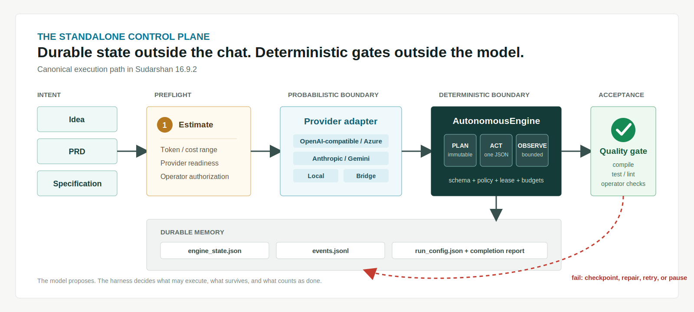
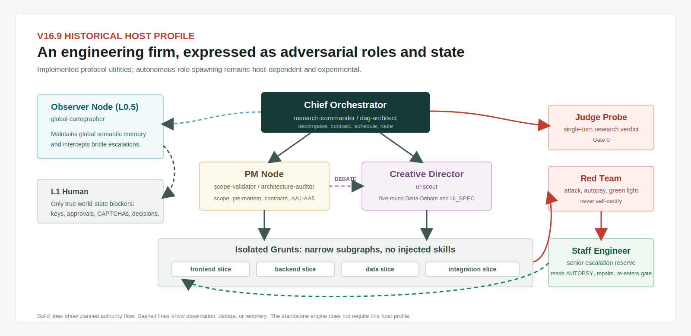
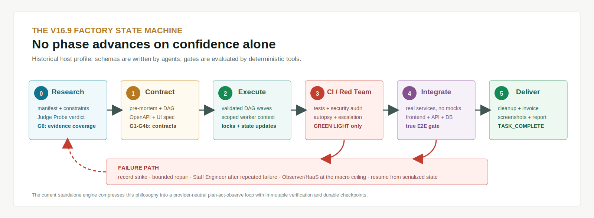

<div align="center">


# Sudarshan

**A deterministic control plane for probabilistic software builders.**

Bring an idea, PRD, or specification. Bring an LLM API or agent framework.
Sudarshan keeps the plan, policy, evidence, budget, failures, and verification state
alive outside the conversation.

[**Quickstart**](#quickstart) &nbsp;|&nbsp; [**How it works**](#how-it-works) &nbsp;|&nbsp; [**V169 architecture**](#the-v169-architecture) &nbsp;|&nbsp; [**Live proof**](#live-acceptance-artifact) &nbsp;|&nbsp; [**Research agenda**](#research-agenda) &nbsp;|&nbsp; [**Limits**](#evidence-and-limits)

<br>

[](https://github.com/Suraj1235/sudarshan-superharness/actions/workflows/ci.yml)


</div>

Sudarshan accepts an **idea, product requirements document, or technical specification**,
produces an explainable token/cost/time estimate, and drives a model through a durable
JSON action loop until real verification passes or an explicit stop condition is reached.

It runs directly against OpenAI-compatible endpoints, Azure Foundry Model Inference,
Anthropic, Gemini, local models, or any agent framework exposed through a small command
bridge. **OpenClaw is a compatibility adapter, not a dependency.**

> [!IMPORTANT]
> Sudarshan is alpha software. It makes orchestration state and gates more deterministic;
> it does not make model reasoning mathematically perfect or guarantee production-quality
> output. Generated software still needs human review, threat modeling, and deployment
> judgment.

## Why This Exists

Suraj Kuncham began researching Sudarshan months ago, when coding models were materially
less capable and agent harnesses were still nascent. Early builders could produce good
local code yet still lose long-run state, repeat failed commands, drift from contracts,
or announce completion without executable proof.

The [V16.9 Master Guide](SUDARSHAN_Guide_V7_Master.md) asked a more structural question:

> What if the conversation were disposable, but the plan, constraints, evidence,
> budget, failures, recovery state, and definition of done were not?

That research evolved through role separation, adversarial review, mathematical DAG
checks, phase gates, scoped context, strike ledgers, relay-baton recovery, and human
escalation. The modern standalone engine distills the most portable parts into a smaller
provider-neutral runtime.

This repository is **not a prompt file**. It contains an executable engine, provider
adapters, confined file tools, controlled subprocess execution, persistent state,
verification discovery, cost estimation, host contracts, compatibility protocols, tests,
installers, schemas, and a real model-built acceptance artifact.

| At a glance | Sudarshan 16.9.2 |
|---|---|
| Input | Idea, PRD, specification, or command-provider request |
| Canonical runtime | Provider-neutral `AutonomousEngine` |
| Model contract | Exactly one schema-validated JSON action per turn |
| Durable memory | Atomic state, append-only events, restored run configuration |
| Completion | Immutable operator checks plus automatic and model-proposed verification |
| Recovery | Checkpoint, bounded observation, retry, pause, human input, resume |
| Historical profile | V16.9 adversarial multi-agent factory, optional and host-dependent |

## How It Works

<p align="center">
  
</p>

1. **Estimate and authorize.** Sudarshan makes the expected token, cost, and time range
   visible before a build starts, then enforces the operator's configured ceilings.
2. **Ask for one action.** The model sees the goal, immutable plan, bounded observations,
   and completion policy. It can return only one valid action at a time.
3. **Execute under policy.** Paths stay inside the workspace; edits must match exactly;
   commands use argument arrays, allowlists, timeouts, and output caps.
4. **Checkpoint and verify.** Every accepted action updates durable state. Completion is
   accepted only when all plan tasks and every selected verification command pass.

The model proposes. Sudarshan decides **what may execute, what survives a restart, what
must be repaired, and what counts as done**.

## Quickstart

### Install

```bash
git clone https://github.com/Suraj1235/sudarshan-superharness.git
cd sudarshan-superharness
python -m venv .venv
```

Activate the environment and install the package:

```bash
# macOS / Linux
source .venv/bin/activate

# Windows PowerShell
# .venv\Scripts\Activate.ps1

python -m pip install -e .
sudarshan doctor
```

The standalone runtime requires Python 3.9+. Git, Node, Docker, SearXNG, and OpenClaw
are detected as optional capabilities, not installation prerequisites.

### Estimate Before Spending

```bash
sudarshan estimate \
  --prd ./PRD.md \
  --model YOUR_MODEL_ID \
  --input-price 1.00 \
  --output-price 4.00 \
  --json
```

The estimator emits low, likely, and high ranges together with every coefficient used.
It is an explainable heuristic, not a calibrated promise; repository size, model behavior,
provider latency, retries, and verification depth can dominate actual usage.

### Build

```bash
export SUDARSHAN_API_KEY="your-key"

sudarshan build \
  --prd ./PRD.md \
  --workspace ./builds/my-product \
  --provider openai-compatible \
  --model YOUR_MODEL_ID \
  --base-url https://YOUR_PROVIDER/v1 \
  --input-price 1.00 \
  --output-price 4.00 \
  --max-cost 100 \
  --verify-command-json '["python","-m","pytest","-q"]' \
  --allow-host-commands
```

PowerShell sets the key with `$env:SUDARSHAN_API_KEY = "your-key"`. Windows PowerShell
5.1 can rewrite quotes inside JSON-valued native arguments; use the stop-parsing form
shown below when passing `--verify-command-json` or `--provider-command-json`.
API keys are read from environment variables and are never persisted in run state.

`--allow-host-commands` is deliberately explicit. Model-requested commands run with your
user privileges; path confinement is **not** an OS sandbox. Use a disposable VM,
container, or low-privilege account for untrusted builds.

### Inspect, Pause, and Resume

```bash
sudarshan status --workspace ./builds/my-product
sudarshan resume --workspace ./builds/my-product
```

Provider and runtime settings are restored from `.sudarshan/run_config.json`. If the
engine needs a real-world decision, it enters `WAITING_FOR_INPUT` instead of inventing
one:

```bash
sudarshan input \
  --workspace ./builds/my-product \
  --value "Use the EU region and PostgreSQL"

sudarshan resume --workspace ./builds/my-product
```

### Prove the Loop Without an API Key

The included deterministic command bridge builds and verifies a tiny calculator through
the same provider contract and completion path:

```bash
sudarshan build \
  --spec ./examples/demo_spec.md \
  --workspace ./builds/bridge-demo \
  --provider command \
  --provider-command-json '["python","examples/demo_command_bridge.py"]' \
  --model deterministic-demo \
  --allow-host-commands
```

It proves the transport, state machine, tools, and completion gate. It is not presented
as an LLM benchmark.

## Live Acceptance Artifact

<p align="center">
  <a href="https://suraj1235.github.io/orbit-shift/">
    
  </a>
  <a href="https://suraj1235.github.io/orbit-shift/">
    
  </a>
</p>

**[Play ORBIT SHIFT](https://suraj1235.github.io/orbit-shift/)** or inspect its
**[public source and test suite](https://github.com/Suraj1235/orbit-shift)**.

ORBIT SHIFT is a real end-to-end Sudarshan run using `Kimi-K2.7-Code` through Azure
Foundry Model Inference. The run survived provider rate limits and process interruption,
repaired an initially failing suite, and reached verification-gated `COMPLETED` after
121 accepted model actions.

| Acceptance evidence | Result |
|---|---|
| Provider route | Azure Foundry through the OpenAI-compatible adapter |
| Model-authored test result | 23 passing tests |
| Independent post-run result | 25 passing tests |
| Browser audit | Chromium at 1440x900 and 360x780 |
| Interaction coverage | Touch start, pause/resume, mute, collision, restart, persisted best score |
| Network behavior | Static game assets only; no external runtime requests |
| Public release | GitHub repository plus GitHub Pages deployment |

The independent audit found mobile touch, paused-input, impact-animation, and audio
feedback defects and repaired them before release. The run also exposed defects in
Sudarshan's Azure query handling, JSON response mode, failed-call token accounting,
completion context, Windows atomic state replacement, and Windows command resolution.
Those framework fixes are now covered by tests.

This is evidence that the harness can complete and recover a real build. It is not a
universal model benchmark or proof that every generated project is production-ready.

## The V16.9 Architecture

Sudarshan now exposes two clearly separated execution profiles. Their shared philosophy
is durable state plus deterministic acceptance; their operating models are different.

| Profile | Role today | Requirement | Maturity |
|---|---|---|---|
| Standalone engine | Canonical `sudarshan build/resume` path | Python and a model route or command bridge | Tested alpha |
| Platform-neutral host contract | Spawn/status/input envelope for external agent hosts | Host implements `PLATFORM_CONTRACT.md` | Implemented boundary |
| V16.9 multi-agent factory | Historical adversarial role and phase profile | A host capable of isolated agents and routing | Experimental / host-dependent |
| OpenClaw adapter | Compatibility installer and router bridge | OpenClaw installation | Optional compatibility |

### The Adversarial Hierarchy

<p align="center">
  
</p>

The Master Guide models software delivery as an engineering firm whose roles are
deliberately unable to self-certify everything they produce.

| Role | Narrow authority | Artifact or gate |
|---|---|---|
| Chief Orchestrator | Research, decomposition, DAG design, routing | `RESEARCH_MANIFEST`, `JIRA_DAG` |
| Observer Node | Global semantic memory and escalation interception | `ARCHITECTURE_STATE.md` |
| PM Node | Scope, pre-mortem, contracts, architecture audit | `SCOPE_MANIFEST`, `PM_AUDIT_REPORT` |
| Creative Director | UI research and structured Delta-Debate | `UI_SPEC`, `DELTA_RULING` |
| Grunts | Dependency-trimmed atomic implementation work | Isolated subgraph and ownership lock |
| Judge Probe | Single-turn research coverage challenge | `RESEARCH_VERDICT`, Gate 0 |
| Red Team | Adversarial code review and green light | Tests, security checks, `AUTOPSY.md` |
| Staff Engineer | Senior repair after repeated worker failure | Strike-ledger escalation |
| L1 Human | Decisions requiring real-world authority | HaaS input and resume |

The Python tools, schemas, skills, observer, heartbeat daemon, DAG utilities, locks, and
router bridges exist in this repository. Fully autonomous role spawning and coordination
remain properties of the external host, not a guarantee made by the standalone engine.

### The Phase and Gate Machine

<p align="center">
  
</p>

| Phase | Purpose | Deterministic boundary |
|---|---|---|
| 0 - Research | Gather evidence, extract constraints, validate scope | Judge verdict plus Gate 0 |
| 1 - Contract | Pre-mortem, architecture, OpenAPI/data/UI contracts | Gates 1-4b and phase snapshot |
| 2 - Execution | Validate DAG, compute parallel waves, run scoped workers | DAG validator and ownership locks |
| 3 - CI / Red Team | Attack the implementation and record failures | Green light, autopsy, strike ceiling |
| 4 - Integration | Exercise real frontend, API, database, and services | True end-to-end gate; mocks banned |
| 5 - Delivery | Cleanup, invoice, screenshots, completion report | Port check and `TASK_COMPLETE` |

This factory profile was the research crucible. The standalone engine compresses its
portable principles into a simpler plan-act-observe loop instead of pretending every
provider or agent host can supply the same multi-agent primitives.

### State Is the Product

The core design choice is to externalize facts that must outlive a model context window.

**Standalone canonical state**

| Artifact | Responsibility |
|---|---|
| `.sudarshan/engine_state.json` | Goal, immutable plan, task status, budgets, usage, retries, lease, completion state |
| `.sudarshan/events.jsonl` | Append-only action, observation, retry, verification, and transition history |
| `.sudarshan/run_config.json` | Restorable provider/runtime settings without API secrets |
| `COMPLETION_REPORT.md` | Final model, usage, steps, and exact passing verification commands |

**V16.9 host-profile state**

| Artifact family | Responsibility |
|---|---|
| Research manifest, verdict, cache, strict constraints | Evidence collection and compressed research memory |
| Scope manifest, pre-mortem, execution plans | Product boundaries and adversarial planning |
| OpenAPI/data contract, UI spec, Delta-Debate | Contract-first architecture and design decisions |
| JIRA DAG, rationale, subgraphs | Dependency correctness and scoped worker context |
| Blackboard, strike ledger, architecture state | Global status, failure economics, and semantic map |
| Baton state, prompt mutations | Host-managed relay and assumption changes |
| Autopsy and completion report | Failure learning and delivery evidence |

### Architecture Invariants

The Master Guide repeatedly returns to four invariants. The current release preserves
them while narrowing claims to what the code can demonstrate.

| Invariant | Interpretation in the current release |
|---|---|
| Three layers | Architecture/policy, navigation/state, tools/execution stay separate |
| Data first | Schemas and persisted state precede model-authored behavior |
| Self-annealing loop | Observe failure, patch, verify, and preserve the evidence; not magical self-healing |
| Local/global separation | Build-local runtime state stays inside the workspace; temporary release work stays outside Git |

## What the Engine Enforces

- Exactly one schema-validated action per model turn
- Immutable plan tasks and dependency ordering once committed
- Workspace path confinement, symlink escape checks, and atomic writes
- Exact-match edits that reject ambiguous replacements
- Command argument arrays with `shell=False`, allowlisting, timeouts, and output caps
- Sensitive environment variables removed from model-requested subprocesses
- Destructive Git recovery commands blocked
- Single-process workspace execution lease with expiry and refresh
- Atomic engine state plus append-only event history after every action
- Preflight input, output, configured-cost, step, and retry limits
- HTTP `Retry-After` handling plus persisted exponential backoff
- Human pause/input/resume without reconstructing a chat transcript
- Operator verification commands that the model cannot remove
- Automatic compile, test, lint, and build command discovery

## Provider and Framework Neutrality

| Route | CLI value | Default key variable | Typical use |
|---|---|---|---|
| OpenAI-compatible | `openai-compatible` | `SUDARSHAN_API_KEY` | OpenAI, Azure, OpenRouter, Groq, Together, DeepSeek, vLLM, LM Studio, Ollama, compatible gateways |
| Anthropic Messages | `anthropic` | `ANTHROPIC_API_KEY` | Native Claude API |
| Gemini generateContent | `gemini` | `GEMINI_API_KEY` | Native Google Gemini API |
| Command bridge | `command` | Bridge-defined | Any local CLI, agent framework, SDK wrapper, or custom inference stack |

<details>
<summary><b>Azure Foundry Model Inference</b></summary>

Keep the base URL query-free and pass the API version separately so Sudarshan can
validate and encode it safely:

```bash
export AZURE_FOUNDRY_KEY="your-key"
sudarshan build --spec ./SPEC.md --workspace ./builds/azure-app \
  --provider openai-compatible \
  --base-url https://YOUR_RESOURCE.services.ai.azure.com/models \
  --api-version 2024-05-01-preview \
  --json-response \
  --api-key-env AZURE_FOUNDRY_KEY \
  --model YOUR_DEPLOYED_MODEL \
  --allow-host-commands
```

`--json-response` requests `response_format: {"type":"json_object"}`. Leave it off
for compatible providers that do not implement that extension.

</details>

<details>
<summary><b>Anthropic and Gemini</b></summary>

```bash
export ANTHROPIC_API_KEY="your-key"
sudarshan build --spec ./SPEC.md --workspace ./builds/app \
  --provider anthropic --model YOUR_CLAUDE_MODEL --allow-host-commands
```

```bash
export GEMINI_API_KEY="your-key"
sudarshan build --idea "Build a tested inventory API" --workspace ./builds/api \
  --provider gemini --model YOUR_GEMINI_MODEL --allow-host-commands
```

</details>

<details>
<summary><b>Free or local models</b></summary>

Point the OpenAI-compatible route at a loopback endpoint. Local HTTP is accepted only
for `localhost`, `127.0.0.1`, or `::1`; remote endpoints must use HTTPS.

```bash
sudarshan build --spec ./SPEC.md --workspace ./builds/local-app \
  --provider openai-compatible \
  --base-url http://127.0.0.1:YOUR_PORT/v1 \
  --model YOUR_LOCAL_MODEL \
  --retry-forever \
  --allow-host-commands
```

No key is required for loopback inference. Results still depend on the model's context
length, tool discipline, structured-output reliability, and coding ability.

</details>

### Any Agent Framework

The command provider sends one JSON request on stdin:

```json
{
  "schema_version": 1,
  "model": "framework-model",
  "messages": [{"role": "system", "content": "..."}],
  "temperature": 0.1,
  "max_output_tokens": 8192
}
```

The bridge returns one JSON object on stdout:

```json
{
  "text": "{\"action\":\"list_files\",\"path\":\".\"}",
  "input_tokens": 1200,
  "output_tokens": 80
}
```

Launch it with an argument array, never a shell string:

```bash
sudarshan build --prd ./PRD.md --workspace ./builds/framework-app \
  --provider command \
  --provider-command-json '["python","my_framework_bridge.py"]' \
  --model framework-model \
  --allow-host-commands
```

Windows PowerShell 5.1 should preserve the JSON quotes with its stop-parsing token:

```powershell
sudarshan --% build --prd ./PRD.md --workspace ./builds/framework-app --provider command --provider-command-json "[\"python\",\"my_framework_bridge.py\"]" --model framework-model --allow-host-commands
```

Arguments after `--%` are literal, so use concrete paths rather than PowerShell variables
on that command line. This form was exercised during the Windows release audit.

That boundary makes Sudarshan a harness around an LLM API **or** a super-orchestrator
around another agent framework without importing its internal SDK.

## Completion Is a Gate

The model cannot finish merely by saying it is done. Every committed plan task must be
complete and every selected verification command must pass.

Sudarshan combines three sources:

1. **Operator commands** supplied with repeatable `--verify-command-json` flags.
2. **Automatic commands** inferred from Python, npm, Cargo, Go, Maven, or Gradle files.
3. **Model commands** proposed during the build, which may add checks but cannot remove
   either of the first two groups.

The resulting `COMPLETION_REPORT.md` records the model, steps, token usage, cost, and
exact passing commands.

## Retry and Budget Controls

| Control | Default | Effect |
|---|---:|---|
| `--max-steps` | `200` | Maximum accepted model actions |
| `--retry-initial` | `5s` | First transient backoff |
| `--retry-max` | `300s` | Local exponential-backoff cap |
| `--max-retries` | unlimited | Optional attempt ceiling |
| `--retry-window-seconds` | `21600` | Six-hour transient retry window |
| `--retry-forever` | off | Removes the elapsed retry window |
| `--max-cost` | unset | Reserves the next call and caps output using configured prices |
| `--max-input-tokens` | unset | Refuses calls whose conservative prompt bound exceeds remaining usage |
| `--max-output-tokens` | unset | Cumulative output allowance passed through to providers |
| `--max-output-per-call` | `8192` | Per-request output cap |

Explicit provider `Retry-After` values are honored. Authentication failures, malformed
responses, and policy failures fail fast. Empty visible responses ending because of the
provider's output limit are retryable and their reported usage is charged before retry.

Budgets are engine-level call-authorization controls, not account-level guarantees.
Provider-side billing, failed requests that report no usage, and an untrusted command
bridge remain outside the engine's control. Use provider account limits as the final
financial guardrail.

`--retry-forever` means effectively unbounded retry duration until the operator interrupts
the process. No software has literal infinite runtime, and no token budget can repair
incorrect requirements or weak acceptance tests by itself.

## Research Agenda

The V16.9 Master Guide contains enough architecture, failure history, mechanisms, and
evaluation targets to support a serious systems paper. The defensible contribution is
not "LLMs become flawless." It is a testable design for moving control state and
acceptance authority out of probabilistic context.

| Research hypothesis | Mechanism | Evidence today | Still needed |
|---|---|---|---|
| Externalized state improves interruption recovery | Atomic checkpoints, append-only events, restored config | Forced interruption/resume tests and the Kimi build | Multi-model long-horizon benchmark |
| Immutable verification reduces false completion | Operator and automatic commands cannot be removed by the model | Adversarial gate tests | Controlled comparison against plain loops |
| Narrow actions reduce unsafe or ambiguous execution | One JSON action, path policy, exact edits, argv commands | Unit, policy, and end-to-end tests | Larger adversarial prompt corpus |
| Scoped context can reduce token bleed without fragmenting architecture | DAG subgraphs plus global architecture state | Implemented utilities and DAG tests | Token/defect ablation at 50-500 tasks |
| Independent critics improve quality over self-review | Judge Probe, PM audit, Red Team, Staff escalation | Protocol implementation and live post-run defect discovery | Host-neutral multi-agent experiment |
| Failure ledgers improve recovery decisions | Retries, strikes, autopsies, bounded escalation | Legacy utilities plus standalone retry history | Comparative cost/reliability study |

A paper-quality evaluation could measure completion rate, false-completion rate, verified
defect density, recovery time after interruption, token cost, repeated-action rate, and
human interventions across providers. The natural ablations are checkpointing on/off,
immutable verification on/off, scoped/global context, and self-review/adversarial review.

The repository makes no claim that this prior-art study or benchmark has already been
completed. Its novelty is the implemented combination and the unusually detailed failure-
driven design record, not a claim that no comparable orchestrator exists anywhere.

## Evolution Through Failure

The Master Guide describes Sudarshan as a sequence of learned constraints: every failure
that could be made deterministic became a tool, schema, gate, or lifecycle rule.

| Era | Failure pressure | Resulting mechanism |
|---|---|---|
| V1-V14 | Context loss and naive wrappers | Relay baton, HaaS bridge, double guardrails |
| V14-V15 | Search dependence and opaque research memory | Local SearXNG profile and file-system research cache |
| V15.6 | Token and hardware burn | Scoped context, routing, RAM/process constraints |
| V15.7 | Hallucinated dependency and architecture confidence | DAG validator, PM audits, contract gates |
| V15.8 | Worker context blindness and brittle escalation | Observer Node, architecture state, port cleanup |
| V16.0-V16.2 | Prompts pretending to be enforcement | Deterministic Python tools and schema templates |
| V16.7 | Models self-scoring their own research | Judge Probe, formal skills, phase checkpoints |
| V16.9 | Corrupt state, race conditions, phase drift | Null guards, locks, phase validation, budget watchdogs |
| Standalone 16.9.2 | Host lock-in and unverifiable portability | Provider adapters, command bridge, durable engine, cross-platform CI |

## Evidence and Limits

| Capability | Current evidence | Status |
|---|---|---|
| Idea/PRD/spec intake and estimate | Deterministic unit and CLI tests | Working; estimate remains heuristic |
| Durable standalone build loop | Local HTTP E2E, command bridge, live Azure/Kimi build | Working |
| 429 recovery and resume | Forced rate limit, checkpoint, and new-process resume | Working |
| Verification cannot be weakened | Adversarial automatic/operator gate tests | Working |
| Concurrent state ownership | Contention tests and repeated Windows stress | Working |
| Windows, macOS, Linux | Public four-job GitHub Actions matrix | Working |
| OpenAI-compatible, Anthropic, Gemini | Wire-contract tests; Azure exercised live | Implemented; not every vendor is live-tested in CI |
| Command/framework provider | Real subprocess stdin/stdout integration test | Working |
| OpenClaw install adapter | Fresh-agent fixture certification | Optional compatibility path |
| Autonomous multi-agent factory | Protocols, adapters, DAG and lifecycle utilities | Experimental / host-dependent |
| Production-scale autonomous delivery | No representative benchmark corpus yet | Not proven |
| OS sandboxing | Explicitly outside the current process boundary | Not provided |
| Token efficiency | Controls exist; the live small-game run was expensive | Needs optimization and benchmarking |

Run the release checks locally:

```bash
python -m pytest tests -q
python verify_installation.py --workspace .
python -m pip wheel . --no-deps
```

The current release passes 161 tests plus 117 subtests locally and is verified in CI on
Ubuntu/Python 3.9, Ubuntu/Python 3.13, macOS/Python 3.13, and Windows/Python 3.13.

## Security Model

Sudarshan assumes the model response is untrusted input, but it is **not** a complete
security boundary.

| Boundary | What Sudarshan provides | What the operator still owns |
|---|---|---|
| Files | Workspace confinement, symlink checks, atomic writes | OS/container filesystem isolation |
| Commands | Explicit enablement, argv arrays, allowlist, timeout, output cap | User privilege and installed-tool risk |
| Secrets | API keys stay in environment; sensitive variables are removed from child commands | Provider key rotation and host secret storage |
| Network | HTTPS required for remote compatible providers; loopback HTTP allowed | Egress policy and provider trust |
| Completion | Immutable checks and recorded evidence | Correct acceptance tests and production review |

Security reports belong in [SECURITY.md](SECURITY.md), not public issues.

## Repository Map

```text
autonomous_engine.py        durable action loop, plans, budgets, retries, completion
sudarshan_cli.py            doctor, estimate, build, status, input, resume
providers.py                OpenAI-compatible, Anthropic, Gemini, command bridge
engine_tools.py             confined file tools and controlled subprocess execution
process_runner.py           bounded cross-platform subprocess capture and termination
quality_gate.py             model-independent verification discovery
estimator.py                explainable token, cost, and elapsed-time ranges
protocol_runtime.py         canonical-state projection into legacy protocol artifacts
safe_edit.py                ownership-token locks for compatibility multi-agent writes
taskmanager.py              legacy gates, strike ledger, and host-profile utilities
observer.py                 historical global-state and escalation observer
heartbeat_daemon.py         historical lifecycle and budget watchdog
templates/                  clean canonical protocol state seeds
skills/                     V16.9 role playbooks
openclaw_*                  optional compatibility adapter and installer helpers
infrastructure/searxng/     optional loopback-only research stack
examples/                   command-provider demo and sample specification
tests/                      unit, concurrency, packaging, adapter, and E2E coverage
```

## Optional SearXNG Research Stack

The standalone engine does not need SearXNG. The historical research profile can use
the bundled local-only stack. It is version-pinned, loopback-bound, limiter-backed, and
refuses to start without an operator-provided secret.

```bash
cd infrastructure/searxng
export SEARXNG_SECRET="$(python -c 'import secrets; print(secrets.token_hex(32))')"
docker compose up -d
```

Do not expose it publicly without following SearXNG deployment guidance and adding a
reverse proxy, authentication policy, monitoring, and update process.

## Documentation

- [V16.9 Master Guide](SUDARSHAN_Guide_V7_Master.md) - historical architecture,
  adversarial hierarchy, phase machine, evolution, hardening record, and research thesis
- [Platform Contract](PLATFORM_CONTRACT.md) - neutral host boundary
- [Installation Guide](INSTALL_SUDARSHAN.md) - standalone and optional compatibility setup
- [Security Policy](SECURITY.md) - threat model and reporting
- [Contributing Guide](CONTRIBUTING.md) - provider and runtime contribution rules
- [OpenClaw API Contract](OPENCLAW_API_CONTRACT.md) - optional adapter contract

The Master Guide is intentionally retained as a public research record. It mixes
implemented mechanisms, host-dependent protocols, and aspirational operating rules.
This README, the source, and executable tests are the authority for what works today.

## Contributing

Read [CONTRIBUTING.md](CONTRIBUTING.md) before opening a change. New providers should
normalize text, usage, retryability, `Retry-After`, redaction, and response limits behind
the existing `Provider` protocol. Runtime changes need failure-path tests, not only happy
paths.

Sudarshan is open for provider adapters, benchmark harnesses, security reviews,
observability work, token-efficiency research, and host-neutral multi-agent experiments.

## Author

**Suraj Kuncham**

Sudarshan began as a months-long attempt to make weaker early coding models sustain
serious builds. More capable models make the architecture more useful today; they do not
remove the need for explicit state, policy, evidence, and honest limits.

## License

[MIT](LICENSE) - inspect it, challenge it, fork it, and build on it.

---

<sub>Provider-neutral LLM software-build harness and experimental multi-agent software-factory architecture. Durable checkpoints, bounded tools, explicit budgets, adversarial verification, human escalation, and cross-platform execution. OpenClaw optional.</sub>
